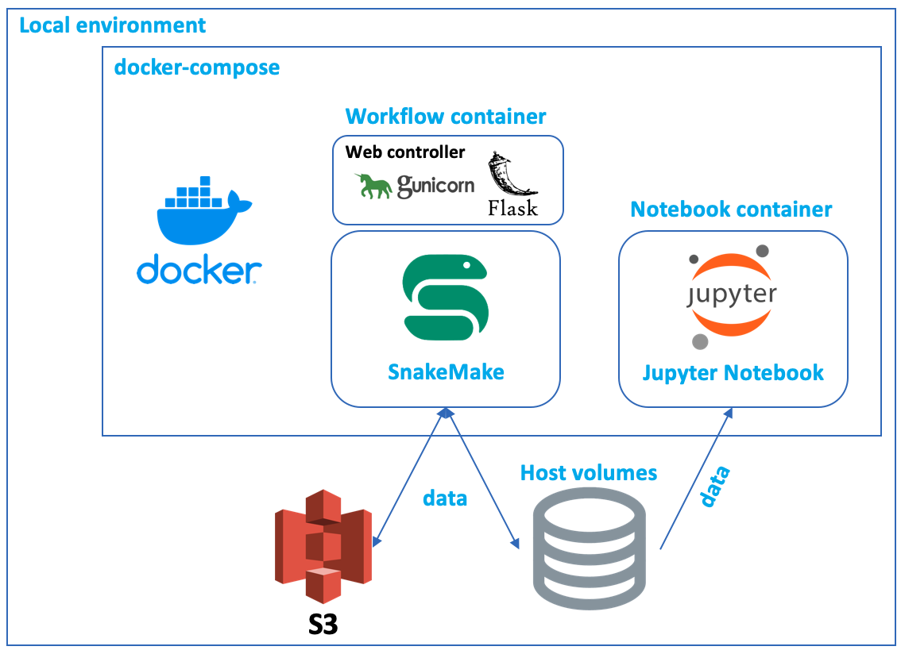

# Multiple Sclerosis Project (Main page and local evironment repository)

* Current members: Nicole Yoon, Kicheol Kim, Junhee Yoon
* Please, leave a message in **Discussions** tab if you have any question and requests
* Please use docker image to analyze the data. AWS module is ready and Please ask to members for getting auth if AWS is needed
* Our data is located in S3 bucket

### Goal
* Finding potential biomarkers and therapeutic target for helping multiple sclerosis patients, **reference**: [Cell type-specific transcriptomics identifies neddylation as a novel therapeutic target in multiple sclerosis](https://pubmed.ncbi.nlm.nih.gov/33374005/)

* Phase 1
  - Extracting significant signal from the dataset and finding Biomarker for **early detection** & **progression**
  - Finding therapeutic target discovery based on biological dataset

* Phase 2
  - Finding and developing actual business ideas or a practical usage case to make this project for helping patients

### Data source
- S3 Bucket (Ask to members)
- NAS for main data distribution

### Snakemake GUI Controller
- **Please refer to this repository for the controller**: [Snakemake GUI Controller](https://github.com/OpenKBC/snakemake-gui-controller)
- Related docker sources:
    | Image name | Location |
    | -----------|----------|
    |snakemake-gui-controller-image|[Link](https://github.com/OpenKBC/snakemake-gui-controller-image)|

### AWS module
- **Please refer to this repository for AWS usage**: [AWS module repository](https://github.com/OpenKBC/multiple_sclerosis_AWSmodule)
- Related docker sources:
    | Image name | Location |
    | -----------|----------|
    |activation-score-batch-image|[Link](https://github.com/OpenKBC/activation-score-batch-image)|
    |deg-pipeline-batch-image |[Link](https://github.com/OpenKBC/deg-pipeline-batch-image)|
    |feature-extraction-batch-image |[Link](https://github.com/OpenKBC/feature-extraction-batch-image)|

### Notebook module
- **Please refer to this repository for Notebook usage**: [Notebook repository](https://github.com/OpenKBC/multiple_sclerosis_proj_notebook)

### Local module
* Usage of docker container
  - 4 images are needed to use services (notebook, pipelines, celery and redis)
  - We are using docker registry to distribute images, please refer to [here](https://hub.docker.com/repository/docker/swiri021/openkbc_msproject/general)
  - Docker compose option
      ```shell
      docker-compose -f docker-compose.yaml up --build # composing up by the codes or
      docker-compose -f docker-compose.example.yaml up # composing up by using the registry
      ```

  - Jupyter notebook container
      ```
      # Access jupyter notebook
      # Please use this in your browser after docker-compose up 
      http://localhost:8888/token_number
      ```

  - Pipeline container
      ```
      # Please use this in your browser after docker-compose up
      http://localhost/
      ```

* Structure of local module Overview
