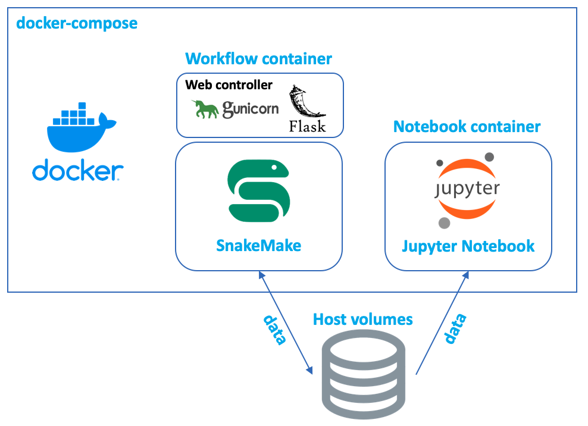

# Korean Bioinformatics Club Project for multiple sclerosis (Open-Project)

* Current members: Kicheol Kim, Junhee Yoon
* Please, leave a message in **Discussions** tab if you have any question and requests
* Please use docker image to analyze the data. Our aws-cli module will be developed soon, please ask to members to get the data currently.

### Goal
* Finding potential biomarkers and therapeutic target for helping multiple sclerosis patients, **reference**: [Cell type-specific transcriptomics identifies neddylation as a novel therapeutic target in multiple sclerosis](https://pubmed.ncbi.nlm.nih.gov/33374005/)

### Phase 1
* Extracting significant signal from the dataset and finding Biomarker for **early detection** & **progression**
* Finding therapeutic target discovery based on biological dataset

### Phase 2
* Finding and developing actual business ideas or a practical usage case to make this project for helping patients

### Resources
* Slides (Ask to members)
* S3 Bucket (Ask to members)
* https://openkbc.github.io/multiple_sclerosis_proj/

### Usage of docker container
* 2 images are composing up for jupyter notebook and workflow. The workflow image does not have controller currently, so user needs to get inside to control it by using docker attach.



* Containers
```shell
docker-compose up # composing up
```

* Jupyter notebook
```
# Access jupyter notebook
http://localhost:8888/token_number
```

* Workflow container
```shell
#Not prepared controller yet, please get into the container to run snakemake workflow separately
docker exec -it container_name_of_pipelines bash
```

* AWS module
```shell
cd aws_module
sh aws_module.sh t2.medium
```

