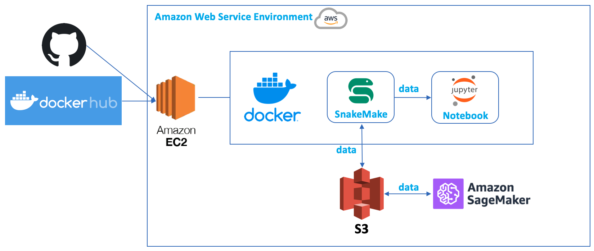

# Multiple Sclerosis Project (Data analysis platform/archive)

* Current members: Kicheol Kim, Junhee Yoon
* Please, leave a message in **Discussions** tab if you have any question and requests
* Please use docker image to analyze the data. AWS module is ready and Please ask to members for getting auth f AWS is needed to analze data.
* Our data is located in S3 bucket

### Goal
* Finding potential biomarkers and therapeutic target for helping multiple sclerosis patients, **reference**: [Cell type-specific transcriptomics identifies neddylation as a novel therapeutic target in multiple sclerosis](https://pubmed.ncbi.nlm.nih.gov/33374005/)

### Phase 1
* Extracting significant signal from the dataset and finding Biomarker for **early detection** & **progression**
* Finding therapeutic target discovery based on biological dataset

### Phase 2
* Finding and developing actual business ideas or a practical usage case to make this project for helping patients

### Resources
* Slides (Ask to members)
* S3 Bucket (Ask to members)
* https://openkbc.github.io/multiple_sclerosis_proj/

### Usage of docker container
* 4 images are needed to use services (notebook, pipelines, celery and redis)
* We are using docker registry to distribute images, please refer to [here](https://hub.docker.com/repository/docker/swiri021/openkbc_msproject/general)

* Containers
```shell
docker-compose -f docker-compose.yaml up --build # composing up by the codes or
docker-compose -f docker-compose.example.yaml up # composing up by using the registry
```

* Jupyter notebook
```
# Access jupyter notebook
# Please use this in your browser after docker-compose up 
http://localhost:8888/token_number
```

* Workflow container
```
# Please use this in your browser after docker-compose up
http://localhost/
```

* AWS module
```shell
cd aws_module/ec2_deployment/
sh aws_module.sh t2.medium # Deploying EC2

cd aws_module/sageMaker_deployment/
sh sagemaker_module.sh ml.t2.medium test-notebook # Deploying sagemaker instance
```
### Structure Overview

#### Local Environment


#### AWS Environment

