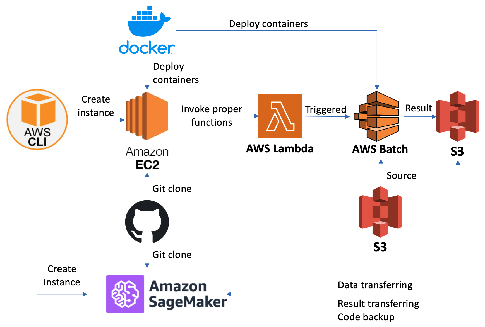

## Instruction
* The project supports AWS deployment and it needs credentials approval by admin. Currently the module provides EC2 and SageMaker. 

### Requirements on local PC
```
apt-get install awscli
apt-get install jq
```

## Modules List
| Name | Description | Main exec file |
|---------|---------|---------|
| ec2_deployment | Module for EC2 auto-deployment | aws_module.sh or ec2_cloudformation_launcher.sh |
| sageMaker_deployment | Module for sageMaker auto-deployment | sagemaker_module.sh |
| lambda_deployment | Module for AWS lambda function creation and invoke (Developing) | lambda_module.sh |
| batch_deployment | Module for AWS Batch work (Developing) | batch_module.sh |


#### Current detail map


#### Full AWS detail map
