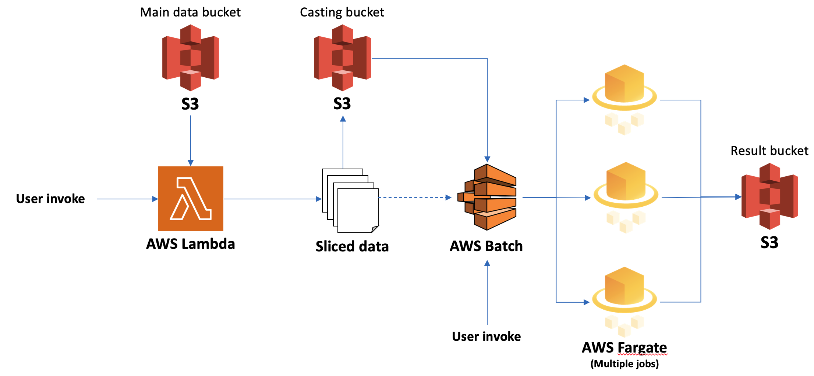

## AWS module for running the project
* This module supports to run the project codes, pipelines and analysis by launching AWS Batch. Currently, it is on development phase and this module can run with limited code (Activation Score Calculation).
* Parallel jobs execution is needed lambda function input, please use lambda_deployment section first

### Requirements on local PC
```
apt-get install awscli
```

### Usage on local PC
* To change sample, please replace JSON file to calculate the score
```json
    "environment": [
        {
            "name": "msigdb",
            "value": "msigdb.v7.4.entrez.gmt(don't change this)"
        },
        {
            "name": "inputfile",
            "value": "Sample name here"
        }
      ]
```
* And run module
```
# Single job
sh batch_module_singleJob.sh 

# Parallelized job
sh batch_module_parallel.sh
```

### Multiple Jobs Flow
