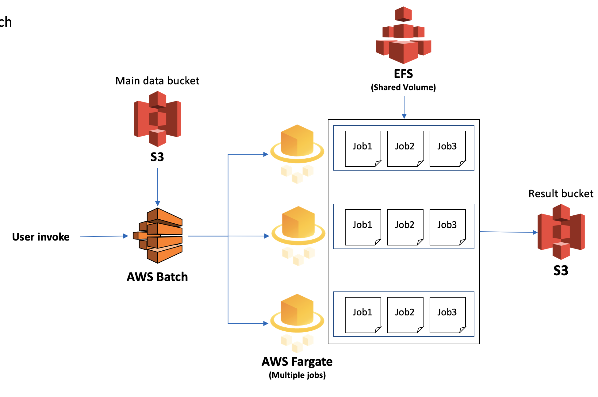

## AWS module for running the project
* This module supports to run the project codes, pipelines and analysis by launching AWS Batch. Currently, it is on development phase and this module can run with limited code (Activation Score Calculation).
* Parallel jobs execution is needed lambda function input, please use lambda_deployment section first

### Requirements on local PC
```
apt-get install awscli
apt-get install jq
```

## Batch Jobs List
| Name | Description | Main exec file |
|---------|---------|---------|
| activation_score_batch | Activation score calculation (Parallelized or Single job)| batch_module_singleJob.sh or batch_module_parallel.sh |
| deg_pipeline_batch | DEG calculation pipeline (Array job, sequential) | batch_module_singleJob.sh |
| feature_extraction_batch | Feature extraction pipeline with activation scores | Developing |


### Multiple Jobs Flow


### Array Jobs Flow (Pipeline)
