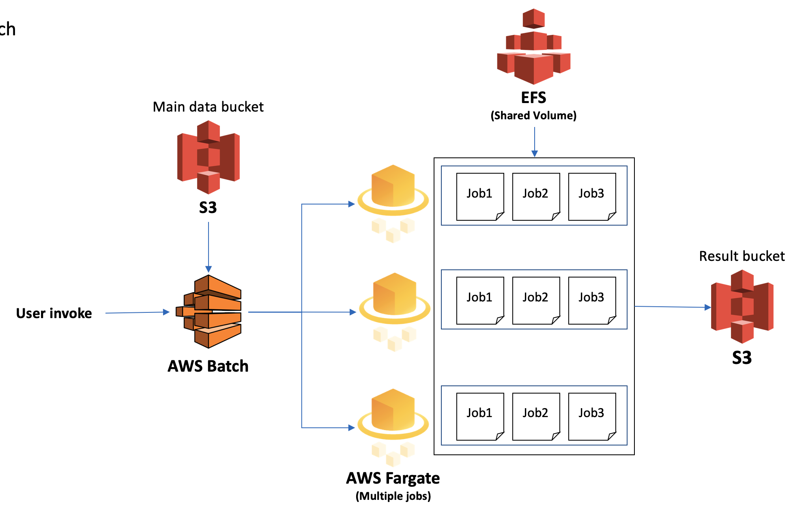

# DEG Pipieline in AWS Batch

## AWS module for running the project
* This module supports to get sample DEG by certain conditions, it is using AWS Batch and need to launch separate running for each cells result(CD4, CD8, CD14)
* There is no parallel job for this and it is sequential job type.

### Requirements on local PC
```
apt-get install awscli
apt-get install jq
```

### Usage on local PC
* To change cell type(CD4, CD8, CD14) or category, please replace JSON file to run them separately
```json
    "command":[ "sh", "pipeline_controller.sh", "CD4", "Sex", "M", "F"], # change here
    "mountPoints": [
        {
            "sourceVolume": "efsVolume",
            "containerPath": "/output",
            "readOnly": false
        }
    ],
```
* And run module
```
sh batch_module_singleJob.sh # For CD4 only
```

### Sequential Jobs Flow
